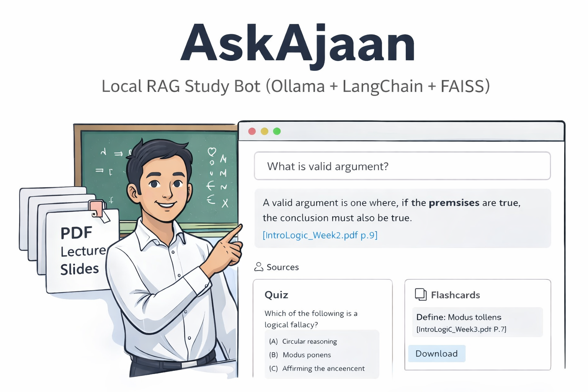
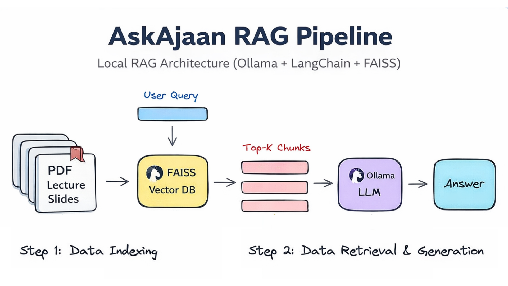

# AskAjaan



Local RAG study bot for Intro to Logic course using Ollama, LangChain, and FAISS.

## Credits

Full credits to **Professor Dr. Natthapong Jungteerapanich** from King Mongkut's Institute of Technology Ladkrabang (KMITL) for his comprehensive Intro to Logic lecture slides that serve as the knowledge base for this application.

## Architecture



## Features

- Answer questions grounded strictly in lecture slides
- Generate practice quizzes
- Create flashcards for exam prep
- All processing runs locally
- Always cites slide sources

## Prerequisites

1. Python 3.10+
2. Ollama installed and running
3. Required Ollama models:
   - `ollama pull llama3.2`
   - `ollama pull nomic-embed-text`

## Setup

1. Install dependencies:
```bash
pip install -r requirements.txt
```

2. Add PDF lecture slides to `data/pdfs/`

3. Build the index (first time only):
```bash
python -m src.ingest
```

## Usage

Run the Streamlit app:
```bash
streamlit run streamlit_app.py
```

### Tabs

- **Chat**: Ask questions about course material
- **Quiz**: Generate practice questions on a topic
- **Flashcards**: Create study cards with Q/A pairs
- **Index Info**: View index status and rebuild if needed

## Project Structure

```
AskAjaan/
├── data/
│   ├── pdfs/            # lecture slides
│   └── faiss_index/     # vector index
├── src/
│   ├── config.py        # configuration
│   ├── ingest.py        # PDF loading and indexing
│   ├── retrieve.py      # FAISS retrieval
│   ├── rag.py           # RAG answering
│   ├── study_modes.py   # quiz and flashcards
│   └── utils.py         # utilities
├── streamlit_app.py     # UI
└── requirements.txt
```

## Configuration

Edit environment variables or defaults in `src/config.py`:

- `OLLAMA_BASE_URL`: Ollama API endpoint (default: http://localhost:11434)
- `LLM_MODEL`: Language model (default: llama3.2)
- `EMBED_MODEL`: Embedding model (default: nomic-embed-text)
- `CHUNK_SIZE`: Text chunk size (default: 900)
- `CHUNK_OVERLAP`: Chunk overlap (default: 150)
- `TOP_K`: Number of chunks to retrieve (default: 5)

## Rebuilding the Index

Rebuild when PDFs are added or changed:
- Use the "Build/Rebuild Index" button in the Index Info tab, or
- Run `python -m src.ingest`

## Notes

- All answers are grounded in retrieved context
- The bot refuses to answer if evidence is missing
- Every answer includes slide citations
- No internet connection required after setup
